# Neural_Network_Charity_Analysis

## Objective

The purpose of this challenge is to utilize our knowledge of machine learning and neural networks, using features in the provided dataset to assist our client in creating a binary classifer that is capable of predicting whether applicants will be successful if funded by Alphabet Soup.

This will be accomplised by completing three technical analysis components and a written report.  The technical analysis includes:
- Preprocessing Data for a Neural Network Model
- Compile, Train, and Evaluate the Model
- Optimize the Model

## Results 

### Data Preprocessing

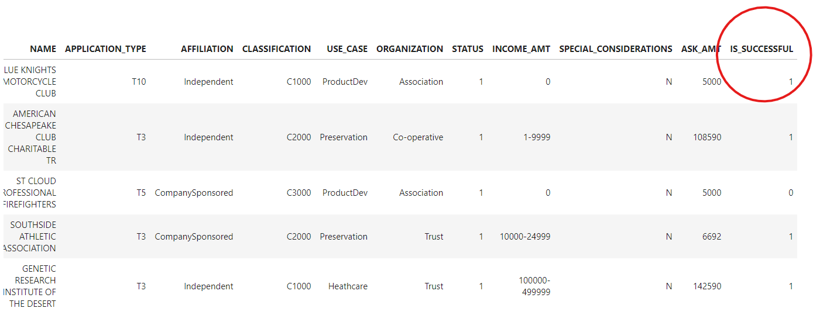

The client requested we answer the following questions:

Q1. What variable(s) are considered the target(s) for your model?

*A1. The IS_SUCCESSFUL column indicates that a charity has been successfully funded by AlphabetSoup, thereby this column will be considered a target for the model.*

Q2. What variable(s) are considered to be the features for our model?

*A2. The IS_SUCCESSFUL column will also be the feature chosen for this dataset.*

Q3. What variable(s) are neither targets nor features, and should be removed from the input data?

*A3. The EIN and NAME columns are neither targets nor features for this dataset and were removed from the input data.*

### Compiling, Training, and Evaluating the Model

**Initial Model Results**

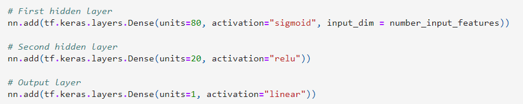

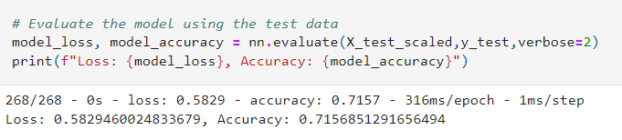

The client requested we answer the following questions:

Q1. How many nuerons, layers,and activation funtions did you select for your neural network model, and why?

A1.

Q2. Were you able to achieve the target model performances?

A2.

Q3. What steps did you take to try and increase model performance?

A3.

**Optimization Results**

*Optimization 1*

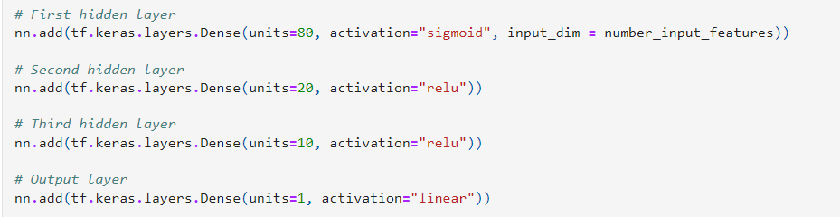

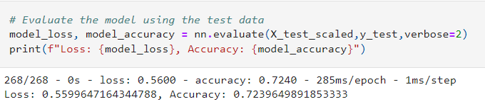

*Optimization 2* 

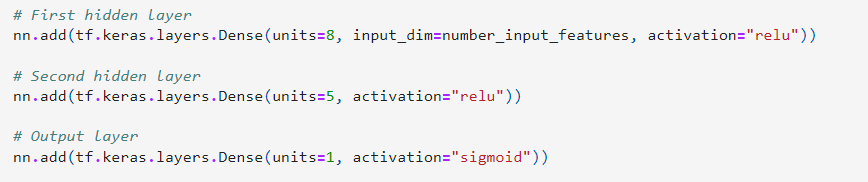

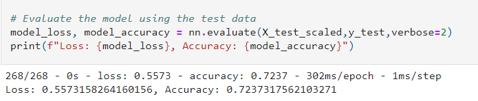

*Optimization 3*

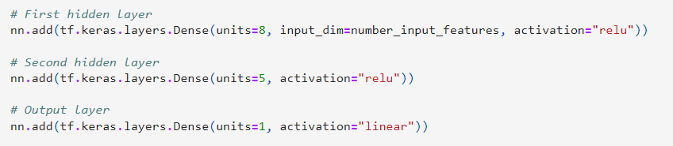

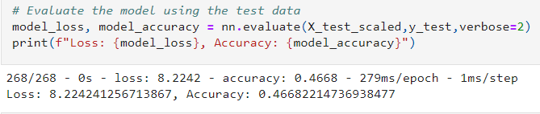

*Optimization 4*

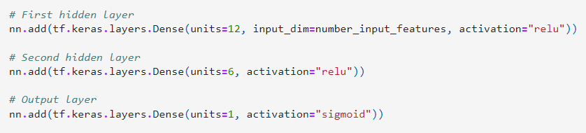

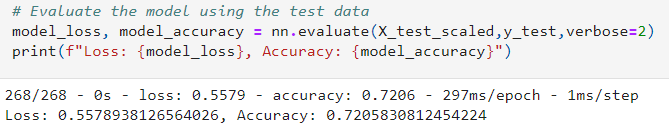

### Summary

